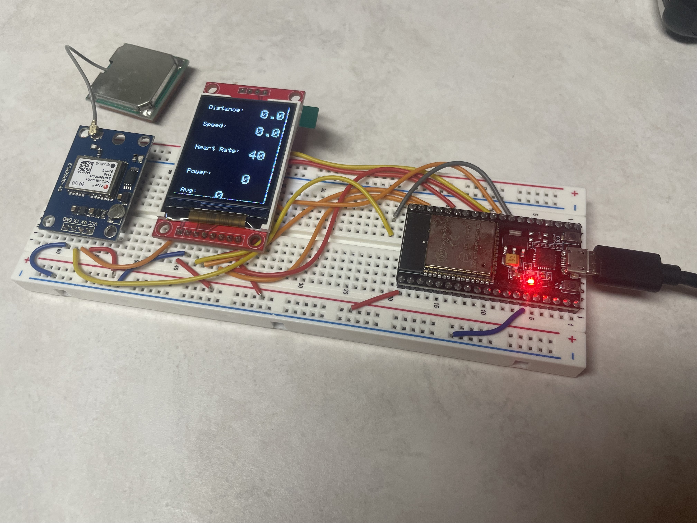

# ESP32 Cycling Computer

Personal hobby project — cycling computer firmware for ESP32 with GPS, BLE heart rate and power sensor integration, and real-time data display on an ST7735S screen.

---

## Overview

This ongoing project implements a cycling computer using an ESP32 microcontroller. It connects via Bluetooth Low Energy (BLE) to heart rate and power meter sensors, parses GPS data for speed and distance tracking, and displays live metrics on a compact ST7735S color TFT display.

The code demonstrates real-time sensor integration, data processing, and embedded display control — showcasing skills relevant to embedded systems and IoT development.

---

## Features

- Connects to BLE heart rate monitors and power meters  
- Parses GPS data for accurate speed and distance measurement  
- Displays heart rate, power, average power, speed (mph), and total distance (miles) on ST7735S display  
- Basic noise filtering on GPS speed data for stability  

---

## Hardware Requirements

- ESP32 development board  
- ST7735S TFT display (SPI interface)  
- BLE heart rate monitor (e.g., chest strap)  
- BLE power meter (e.g., Garmin Vector 3)  
- GPS Neo 6m module (connected via UART)  

---

## Wiring

| Component           | ESP32 Pin      |
|---------------------|---------------|
| ST7735S TFT CS      | GPIO 5         |
| ST7735S TFT DC      | GPIO 21        |
| ST7735S TFT RST     | GPIO 22        |
| GPS RX              | GPIO 16        |
| GPS TX              | GPIO 17        |

*Note:* BLE uses ESP32’s internal Bluetooth hardware — no wiring needed.

---

## Usage

1. Upload the firmware to your ESP32.  
2. Power the device and ensure GPS and BLE sensors are active and nearby.  
3. The cycling computer will scan and connect automatically to the configured heart rate and power meter devices via BLE.  
4. Live data will be displayed on the TFT screen, updating every 200 ms.  

---

## Future Features

- Cadence data parsing from BLE sensors  
- Onboard SD card storage for ride data logging  
- Exporting ride data in the standard `.fit` file format used by athletic tracking devices  
- User interface with button-controlled menu navigation  
- Rechargeable lithium-ion battery integration for portable power  
- Compact, weather-resistant enclosure designed with 3D printing  

---

## License

This project is licensed under the MIT License — see the [LICENSE](LICENSE) file for details.

---

## Contributions & Feedback

This is a personal hobby project in active development.

---

## Contact

Andrew Logsdon  
[GitHub Profile](https://github.com/ALog999)

